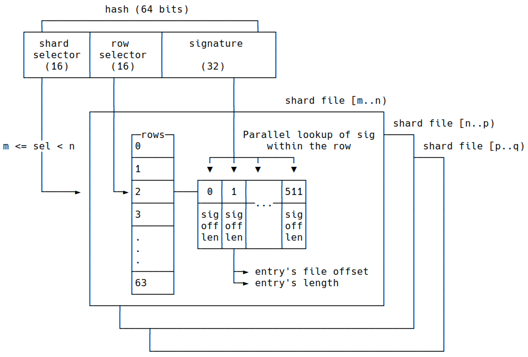

# CandyStore
A pure rust implementation of a fast (*blazingly* :tm:, of course), persistent, in-process key-value store, that relies 
on a novel sharding algorithm. Just how blazingly? It's over 9000!

| Operation | Time*  |
|-----------|--------|
| Lookup    | < 1us  |
| Insert    | < 2us  |
| Removal   | < 1us  |

The algorithm can be thought of as a "zero-overhead" extension to a hash table stored over files, 
as it's designed to minimizes IO operations. See [the benchmark](candy-perf/README.md) and 
[how to interpret the results*](#how-to-interpret-the-performance-results).

## Overview
Being a hash-table, the key is hashed, producing a 64 bit number. The 16 most significant bits select 
the *shard*, followed by 16 bits selecting the *row* in the shard, and the remaining 32 bits serve as an
opaque signature. The signature is matched against the signature array within the selected row (using SIMD). 
The row also stores the file offset of the entry, which is used to retrive the entry's key and value.



Each shard is mapped to a shard file, and a shard file can cover a wide range of consecutive shards.
We begin with a single shard file covering the whole shard span of `[0-65536]`.

When a shard file gets too big, or when one of its rows gets full, it undergoes a *split*.
This operation takes all entries and splits them into a bottom half and a top half (of roughly
equal sizes). For instance, if the file covered shards `[0-65536)`, after the split we have two files,
one covering `[0-32768)` and the other covering `[32768-65536)`. This process repeats as needed,
and essentially builds a tree of shard files. Each file is split independently, and the amount of work
is constant (unlike LSM trees).

```
               [0-65536)
              /         \
             /           \
          [0-32768)    [32768-65536)
         /         \
        /           \
    [0-16384)     [16384-32768)  
```

The shard file's header (the rows, signatures and file offsets) are kept in an `mmap`, and the rest
of the file's data is accessed using `pread` and `pwrite`. The file is only ever extended (until either
a split or *compaction* takes place), so the algorithm is *crash safe*, in the sense that it will always
return some valid version of a key-value pair, although it might lose unflushed data.

The library puts its faith in the kernel's page cache, and assumes the `mmap` and writes are flushed to
disk every so often. This allows us to forgo a journal or write-ahead log (WAL).

The default parameters (chosen by simulations) are of shards with 64 rows, each with 512 entries. The chances 
of collisions with these parameters are minimal, and they allow for ~90% utilization of the shard, while
requiring relatively small header tables (32K entries, taking up 384KB). With the expected 90% utilization, 
you should be expect to hold 29.5K keys per shard. For a shard file of 64MB, that's 0.6% overhead.

Because the data structure is a hash table rather than a search tree, insertion, lookup and removal are 
all O(1) operations.

The concept can be extended to a distributed database, by adding a layer of master-shards that select a 
server, followed by the normal sharding mechanism described above.

## Example
```rust
use candystore::{Config, Result, CandyStore};

let db = CandyStore::open("/tmp/candy-dir", Config::default())?;

// simple API

db.insert("mykey", "myval")?;
assert_eq!(db.get("mykey")?, Some("myval".into()));

assert_eq!(db.get("yourkey")?, None);

assert_eq!(db.iter().count(), 1);

for res in db.iter() {
    let (k, v) = res?;
    assert_eq!(k, "mykey".into());
    assert_eq!(v, "myval".into());
}

assert_eq!(db.iter().count(), 0);

// lists API

db.set_in_list("mylist", "key1", "123")?;
db.set_in_list("mylist", "key2", "456")?;
assert_eq!(db.get_from_list("mylist", "key1")?, Some("123".into()));

assert_eq!(db.iter_list("mylist").count(), 2);

for res in db.iter_list("mylist") {
    let (k, v) = res?;
    println!("{k:?} => {v:?}");
}
```

## Design Goals
* Fast and efficient, with a very low memory footprint (~0.6% overhead)
* No heavy/unbounded merges
* No Write-Ahead Log (WAL) or journalling of any kind
* Crash safe: you may lose the latest operations, but never be in an inconsistent state
* Splitting/compaction happens per-shard, so there's no global locking
* Suitable for both write-heavy and read-heavy workloads
* Concurrent by design (multiple threads getting/setting/removing keys at the same time)
* The backing store is taken to be an SSD, thus it's not optimized for HDDs

## Notes
* The file format is not yet stable
* Requires nightly (for `simd_itertools`), uses very little `unsafe` (required due to `mmap`)

## Roadmap
* Distributed protocol based on file locks (meant to run on a shared network folder)
* Add generations as an adapter on top, so that older generations are compacted into exponentially larger 
  time spans. It's an alternative to TTL, and amortizes the number of times an entry will move around as the 
  dataset grows.
* Maybe add Arithmethid coding/Huffman coding as a cheap compression for the keys and values

## How to Interpret the Performance Results
While the numbers above are incredible, it is obvious that any file-backed store will be limited by the
filesystem's latency and bandwidth. For example, you can expect a read latency of 20-100us from SSDs (NVMe),
so that's the lower bound on reading a random location in the file. 

What the numbers above measure is the performance of the *algorithm*, not the *storage*: given you can spare an 
overhead of 0.6% mapped into memory, lookup/insert/removal require a single disk IO. Replacing (updating) an 
existing element requires two IOs, since it needs to compare the key before writing it anew.
These IOs may return from the kernel's page cache, in which case it's practically immediate, or from disk,
in which case you can expect it to take 1-2 round-trip times of your device.

Inserting to/removing from a lists require 2-3 IOs, since these operations need to update the list's 
head or tail, as well as link/unlink to their previous element. Such operations should really be done with a "large enough page cache". 
Updating/fetching an existing element element in a list is a single IO as above.

If your memory is too constrainted for keeping the lookup tables mapped-in (i.e., they get evicted to disk),
you'll incur one more unit of "IO latency" for fetching the row from the table. Since the row spans 2KB (and 
aligned to 4KB), it should behave nicely with 4K IOs.

