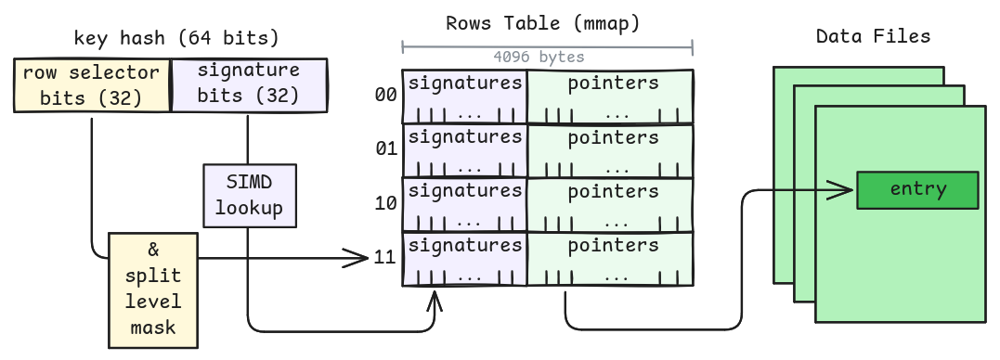
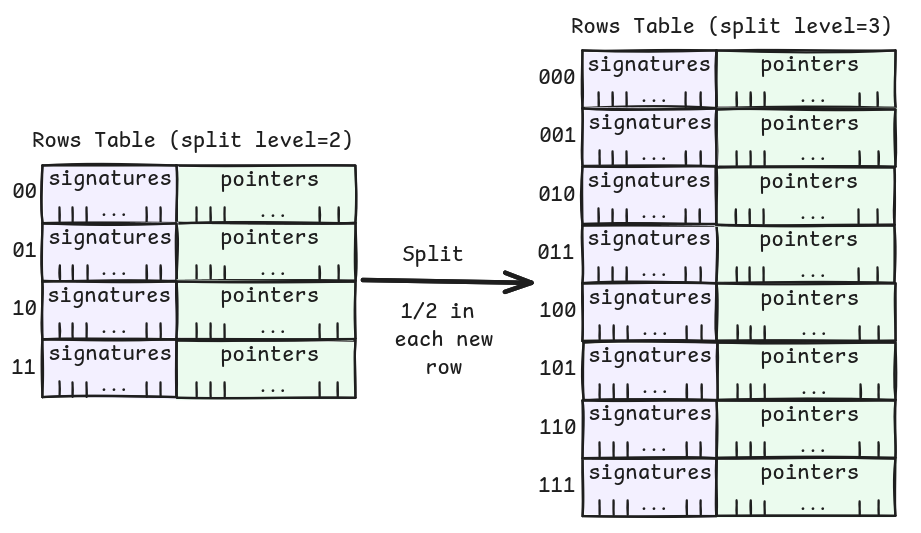

# CandyStore

A pure Rust implementation of a fast (*blazingly* :tm:, of course), persistent, in-process
key-value store that relies on a hash-based sharding algorithm. All operations — lookup,
insert, and removal — are O(1).

| Operation | Time*  |
|-----------|--------|
| Lookup    | < 1us  |
| Insert    | < 1us  |
| Update    | < 2us  |
| Removal   | < 2us  |

On my laptop (32 core AMD RYZEN AI MAX+ 395 with 64GB RAM, running Ubuntu 25.10 kernel `6.17.0-19-generic`) I'm getting

```bash
$ cargo run --release --example perf

Testing key-value using 1 threads, each with 1000000 items (key size: 16, value size: 16)
    Inserts: 0.499239 us/op
    Updates: 0.611424 us/op
    Positive Lookups: 0.316884 us/op
    Negative Lookups: 0.045079 us/op
    Iter all: 0.373904 us/op
    Removes: 0.588206 us/op

```

See [how to interpret the results\*](#how-to-interpret-the-performance-results).

## APIs

Candy offers
* A simple key-value API (`get`, `set`, `remove` and atomic operations like `replace`)
* A typed interface on top (`get<K,V>`, `set<K,V>`, etc.)
* Double-ended queues (`push_to_queue_tail`, `pop_queue_head`, etc.) as well as a typed interface on top of them
* Lists (`get_from_list`, `set_in_list`, etc.) as well as a typed interface on top of them
* The DB is completely thread-safe in idiomatic Rust (just `Arc<>` it)

```rust
use candystore::{CandyStore, Config, Result};

fn main() -> Result<()> {
    let db = CandyStore::open("/path/to/db", Config::default())?;

    db.set("hello", "world")?;
    let val = db.get("hello")?;
    assert_eq!(val, Some(b"world".to_vec()));
    db.remove("hello")?;

    db.set_in_list("cities", "barcelona", "")?;
    db.set_in_list("cities", "chicago", "")?;
    db.set_in_list("cities", "caracas", "")?;

    let cities: Vec<String> = db.iter_list("cities")
        .map(|res| String::from_utf8(res.unwrap().0).unwrap())
        .collect();

    assert_eq!(cities, vec!["barcelona", "chicago", "caracas"]);

    Ok(())
}
```

## Algorithm

The algorithm can be thought of as a "zero-overhead extension" to a hash table stored over
files, designed to minimize IO operations. It does not employ a WAL or a journal, and instead 
uses append-only files that serve both as a source of truth and as the final data structure. 
Unlike LSM-based stores that need to maintain large SSTables in memory, sort them and later 
merge them, Candy uses a small mmap'ed index that points to on-disk data directly.



The core of the algorithm is the concept of *hash coordinates*: breaking up a 64-bit hash 
into two 32-bit values, a *row selector* and a *signature*, which can be thought of 
as coordinates into the rows table. First, the row selector is used to locate the relevant
row in the table, and the signature locates the column. To find the row, we take the row
selector's bits and mask them with a *split level mask*, essentially, the number of rows 
in the table. 

To locate the signature (32 bits) within the row, we employ a parallel lookup (using SIMD) 
to find the matching column(s). Then we fetch the corresponding pointers for the matched 
columns, from which we extract another 18 bits of entropy. If both match, we fetch the entry
from the relevant file (the pointer stores a file index and a file offset). 

Note: the chances of a collision (meaning we fetch a wrong entry from the file) are 
virtually zero, about 1 in 20 billion according to the birthday paradox (a collision in 336 
uniformly-distributed 50-bits numbers). 

Candy supports up to 4096 files, each up to 1GB in size (a span of 4TB). In terms of key-space,
Candy allows 2^21 rows, each with 336 keys, so a total of 704M keys. The maximum size of a key
is 16KB and the maximum size of a value is 64KB. Of course these are theoretical limits, 
it would be wise to halve them in practice due to imbalances.

### Splitting

What happens when a row reaches its limit of 336 keys? We need to split it, of course.
To do that, we increase the row's split level by one, which means we take an extra bit 
into account when selecting the row. For example, row 2 (0b010) will be split into 
rows 2 (0b0010) and 10 (0b1010). Because the bits are uniformly distributed, we expect about
half of the entries to move from row 2 to row 10.



Note that splitting may require increasing the global split level (the size of the table)
which will incur doubling the mmap's size. This may sound like a costly operation, but since
it's file-backed it's mostly only page-table work, and it's amortized. And since we only 
split a single row -- we do not need to rehash the whole table -- the amount of work we 
do is O(1). 

Another optimization is that the pointer contains 18 bits of the row selector, which means
we do not need to read and recompute the hash coordinates of the keys. Splitting is thus
memory-bound.

### Compaction

Data is always written (appended) to the *active data file*. When a file reaches a certain size,
Candy rotates the active files and creates a new one. The old file becomes an *immutable data 
file*. 

As data is created, updated and removed, the store accumulates waste. To handle it we have 
*background compaction*: a thread that iterates over the rows table, finds all entries that
belong to files that should be compacted and rewrites them to the active file. After such
a pass, it simply deletes the old immutable file since no entry points to it. 

You can configure the throughput (bytes per second) of compaction.

### Rebuild

We trust the operating system to flush the data files and mmap'ed rows table to storage,
which means that even if your process crashes, your data will be fully consistent. However,
this is not true on a power failure or a kernel panic -- in which case the state of the
index file is unknown. In such cases Candy has an efficient rebuild mechanism (based on checkpointing)
that essentially replays recent mutating operations in order and rebuilds the correct state from
the data files.

## Design Goals

Unlike many key-value stores, Candy serves the purpose of *reducing* the memory footprint of your
process, e.g., offloading data to the disk instead of keeping it in-memory. It intentionally does not 
include any caching/LRU layer like many traditional KVs/DBs.

Example use cases for Candy are
* A hash table that needs to hold more keys than you can hold in memory
* Persistent work queues (e.g., producers append large work items to a queue and consumers then fetch 
  and perform them) 
* A caching layer for your application logic

It is designed to be durable for process crashes (where the kernel will flush everything properly)
but it does not attempt to optimize for durability under kernel panics (full rebuild).

## How to Interpret the Performance Results

While the numbers shown above are incredible, it is obvious that any persistent store will be
limited by the underlying latency and bandwidth of the storage. For example, you can expect a 
read latency of 20-100us from SSDs (NVMe), so that's the lower bound on reading a random
location in the file.

What the numbers above measure is the performance of the *algorithm*, not the *storage layer*:
given the index can be kept mapped into memory (12 bytes per item), lookup and insert require
a single disk IO, while updating or removing requires two IOs. These IOs may be served 
from the kernel's page cache, in which case you only pay for the syscall's latency, or 
from disk, in which case you can expect it to take 1-2 round-trip times of your device.
